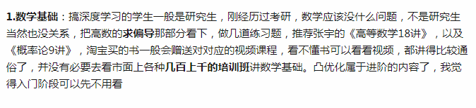

## References

- [如何入门深度学习？](https://zhuanlan.zhihu.com/p/21475898)
- [如何自学人工智能](https://www.zhihu.com/question/21277368/answer/277626779)
- [Concept](https://www.zhihu.com/question/22553761)
- 
- [台大教程](http://speech.ee.ntu.edu.tw/~tlkagk/courses_MLDS18.html)

- [神经网络，人工智能这块怎么入门？](https://www.zhihu.com/question/31497611)

## Mathematics
- Linear algebra
    - Videos
        - [ ] [麻省理工的线性代数公开课](http://open.163.com/special/opencourse/daishu.html)
    - Books
        - [ ] [线性代数及其应用](https://book.douban.com/subject/1425950/)
        - [ ] [程序员的数学3：线性代数](https://book.douban.com/subject/26740548/)
- Caculus
    - Videos
        - [ ] [高等微積分 - 臺大開放式課程 (NTU OpenCourseWare)](http://ocw.aca.ntu.edu.tw/ntu-ocw/ocw/cou/101S130)
- Statistics
    - Books
        - [ ] [统计学习方法](https://book.douban.com/subject/10590856/)

## Python
- Articles
    - [ ] [Learn Data Science with Python](https://www.analyticsvidhya.com/blog/2016/01/complete-tutorial-learn-data-science-python-scratch-2/)
    - [ ] [Learn Python for Data Science](https://elitedatascience.com/learn-python-for-data-science)

## Machine Learning
- Videos
    - [ ] [吴恩达机器学习课程](https://study.163.com/course/courseMain.htm?courseId=1004570029)
- Books
    - [ ] [Neural Networks and Deep Learning](http://neuralnetworksanddeeplearning.com/)
    - [ ] [deeplearningbook](http://www.deeplearningbook.org/)
    - [ ] [Deep Learning-500-questions](https://github.com/scutan90/DeepLearning-500-questions/)
- Articles
    - [ ] [RNN](http://karpathy.github.io/2015/05/21/rnn-effectiveness/)
    - [ ] [LSTM](http://colah.github.io/posts/2015-08-Understanding-LSTMs/)
    - [ ] [RL](http://karpathy.github.io/2016/05/31/rl/)
- PDFS
    - [ ] [Deep Learning Tutorial By Hung-yi Lee](../../Assets/PDF/deeplearningtutorials.pdf)